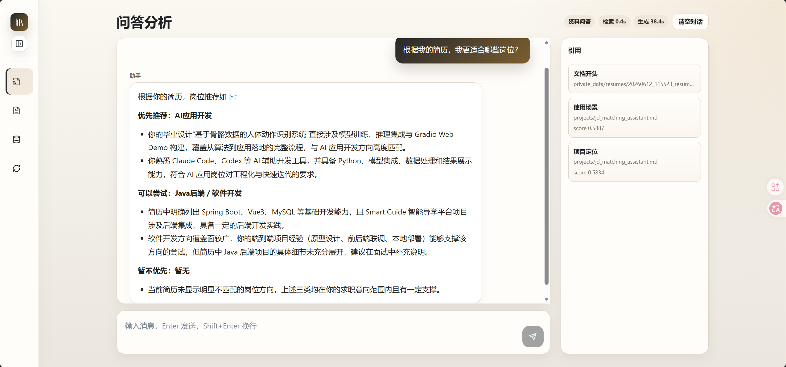
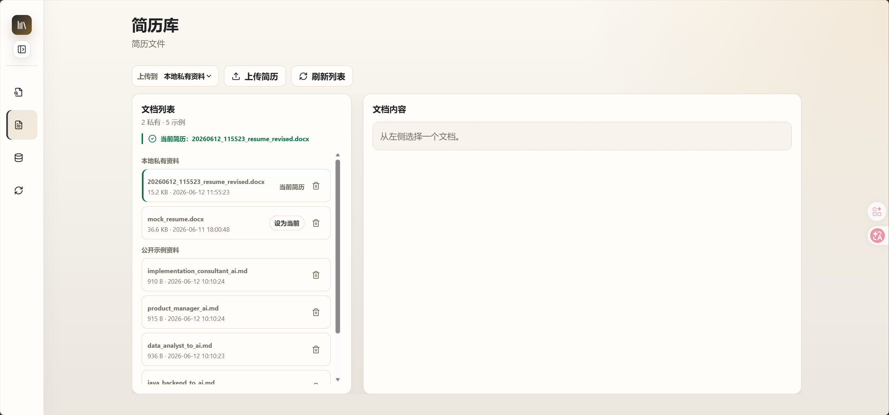
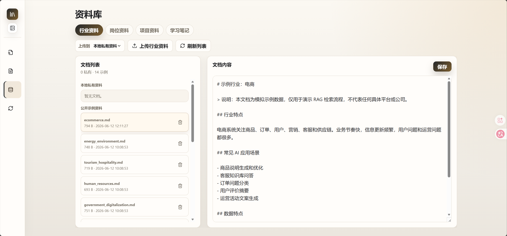
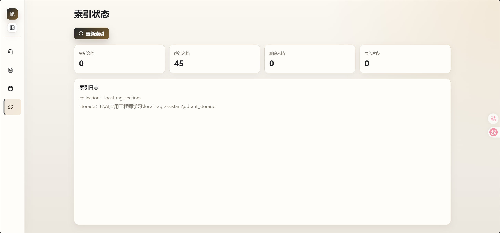

# Local RAG Assistant

Local RAG Assistant 是一个面向求职资料管理和岗位匹配分析的本地 RAG 应用。它支持上传简历、岗位 JD、行业资料、项目说明和学习笔记，通过 Qdrant 本地向量检索和大模型问答，帮助用户分析适合的岗位方向、简历修改建议和项目经历匹配点。

这个项目重点展示 AI 应用开发中的工程能力：文档加载、文本切分、Embedding、向量数据库、增量索引、RAG 问答、基础任务路由、流式输出、引用来源展示、私有资料管理和 Web 工作台。

## 功能概览

- 支持 `.md`、`.docx`、`.pdf` 文档。
- 支持公开示例资料和本地私有资料分离管理。
- 支持简历中心，用户可以设置“当前简历”。
- 简历分析类问题会优先使用当前简历，避免把示例简历误当成用户本人。
- 支持行业、岗位、项目和学习笔记资料的上传、删除和 Markdown 编辑。
- 使用 `BAAI/bge-m3` 生成文本向量。
- 使用 Qdrant 本地文件模式保存和检索向量。
- 支持增量索引，未修改文档不会重复生成 Embedding。
- 支持基础多轮对话、普通对话和项目复盘类追问。
- 支持任务路由，可区分项目复盘、简历修改、岗位推荐、技术解释和知识库维护等问题。
- 支持流式输出，前端实时显示模型生成过程，并在完成后使用后端最终答案校准展示内容。
- 支持回答完整性校验，对明显未完成的回答可自动续写一次。
- 回答会展示引用来源、检索耗时和生成耗时。
- 提供 React + FastAPI Web 工作台。

## 界面预览

### 问答分析

用于围绕当前简历、岗位资料、项目资料和学习笔记进行多轮问答。


### RAG 问答与引用来源

回答区展示模型回复，右侧展示本次检索命中的引用来源，便于核对依据。



### 简历中心

支持上传简历、删除简历、设置当前简历；简历分析会优先使用当前简历。



### 资料库

支持管理行业、岗位、项目和学习笔记资料，Markdown 文档可在线编辑。



### 索引状态

资料变更后可更新本地向量索引，并查看更新、跳过、删除和写入片段数量。



## 适用场景

- 根据当前简历分析适合的岗位方向。
- 针对目标岗位生成简历修改建议。
- 分析项目经历和岗位 JD 的匹配点。
- 查询不同行业的 AI 应用场景。
- 管理学习笔记、项目说明和岗位资料。

## 技术栈

- Python 3
- FastAPI
- React
- TypeScript
- Vite
- Qdrant local mode
- qdrant-client
- python-docx
- pypdf
- requests
- 硅基流动 API
- Chat 模型：`deepseek-ai/DeepSeek-V4-Pro`
- Embedding 模型：`BAAI/bge-m3`

模型价格、限额和可用性以平台控制台为准。

## 项目结构

```text
local-rag-assistant/
  backend/
    app.py               # FastAPI 后端入口
    document_service.py  # 资料管理和当前简历状态
    prompt_templates.py  # 不同任务类型的 Prompt 模板
    rag_service.py       # RAG 问答服务
    schemas.py           # API 数据结构
    task_router.py       # 任务路由和上下文计划
  data/
    industries/          # 公开行业示例资料
    job_descriptions/    # 公开岗位示例资料
    learning_notes/      # 公开学习笔记
    projects/            # 公开项目示例资料
    resume_samples/      # 公开脱敏简历样例
  frontend/
    src/
      App.tsx            # React 工作台
      api.ts             # 前端 API 调用
      styles.css         # 界面样式
  private_data/          # 本地私有资料，不提交到 Git
  qdrant_storage/        # 本地向量库，不提交到 Git
  src/
    build_index.py       # 命令行增量索引入口
    document_loader.py   # md/docx/pdf 文档加载
    indexer.py           # 可复用索引构建逻辑
    main.py              # 命令行 RAG 问答入口
  tools/
    rag_quality_check.py # RAG 回答质量检查脚本
```

## 环境变量

不要把真实 API Key 写进代码或提交到 GitHub。

PowerShell 临时配置：

```powershell
$env:SILICONFLOW_API_KEY="your_siliconflow_api_key_here"
```

也可以在项目根目录创建 `.env`，后端和索引脚本会自动读取：

```env
SILICONFLOW_API_KEY=your_siliconflow_api_key_here
```

前端默认请求本地后端：

```env
VITE_API_BASE_URL=http://127.0.0.1:8000
```

可以参考 `.env.example`，但不要提交真实 `.env` 文件。

## 安装依赖

后端依赖：

```powershell
python -m venv .venv
.\.venv\Scripts\Activate.ps1
pip install -r requirements.txt
```

前端依赖：

```powershell
cd frontend
npm install
```

## 启动应用

先启动后端：

```powershell
uvicorn backend.app:app --reload --host 127.0.0.1 --port 8000
```

再启动前端：

```powershell
cd frontend
npm run dev
```

默认访问地址：

```text
http://127.0.0.1:5173
```

## 使用流程

1. 配置 `SILICONFLOW_API_KEY`。
2. 启动 FastAPI 后端。
3. 启动 React 前端。
4. 在“简历中心”上传简历，并设置当前简历。
5. 在“资料库”上传或编辑行业、岗位、项目和学习笔记资料。
6. 在“索引状态”中点击“更新索引”。
7. 在“问答分析”中提问。

示例问题：

```text
根据我的简历，我更适合哪些岗位？
为什么？
那我应该优先修改哪些地方？
针对 AI 应用开发工程师岗位，这份简历应该怎么修改？
企业软件行业有哪些 AI 应用场景？
```

## 页面说明

- 问答分析：进行普通对话、RAG 问答和多轮追问。
- 简历中心：上传简历、删除简历、设置当前简历。
- 资料库：管理行业资料、岗位资料、项目资料和学习笔记。
- 索引状态：更新 Qdrant 本地向量索引，查看索引日志。

## 当前简历机制

简历库中可能存在多份简历，也可能包含公开脱敏样例。为了避免 RAG 把示例简历当成用户本人，系统提供“当前简历”机制：

- 如果只有一份私有简历，系统会自动将它作为当前简历。
- 如果有多份私有简历，用户需要手动设置当前简历。
- 涉及“我的简历”的问题会优先使用当前简历。
- 如果当前简历尚未进入向量索引，系统会提示先更新索引。
- 公开示例简历只用于演示，不应作为真实用户简历使用。

## 资料目录

公开示例资料放在 `data/` 下，适合提交到 GitHub。真实个人资料放在 `private_data/` 下，不会提交到 Git。

```text
data/
  industries/
  job_descriptions/
  learning_notes/
  projects/
  resume_samples/

private_data/
  resumes/
  industries/
  job_descriptions/
  projects/
  learning_notes/
```

建议公开资料优先使用 Markdown，并用标题组织内容，例如：

```markdown
# 文档标题

## 小节标题
```

## RAG 流程

```text
上传或放入资料
-> 加载 md/docx/pdf
-> 按标题切分文档片段
-> 调用 Embedding API 生成向量
-> 写入 Qdrant 本地向量库
-> 用户提问
-> 为问题生成向量
-> Qdrant 检索相关片段
-> 拼接上下文并发送给 Chat 模型
-> 流式输出回答
-> 返回最终答案、引用来源和相似度分数
```

## 隐私说明

- `private_data/` 已加入 `.gitignore`，不会提交到 GitHub。
- `qdrant_storage/` 已加入 `.gitignore`，不会提交到 GitHub。
- `.env` 已加入 `.gitignore`，不要提交真实 API Key。
- 真实资料在建索引和问答时会发送给模型 API。
- 如果不希望第三方 API 处理真实隐私内容，请先脱敏，或只使用模拟资料。

## 局限性

- 内置行业、岗位和简历资料是模拟示例，不代表实时招聘市场。
- 当前使用 Qdrant 本地文件模式，不是生产级部署方案。
- 当前不是多人协作平台，缺少完整权限管理、高并发处理、审计日志和企业级部署能力。
- 多轮对话主要依赖前端历史、任务路由和上下文组装，不等同于生产级会话记忆或复杂 Agent 编排。
- 当前尚未实现混合检索和重排序，引用溯源粒度仍有改进空间。
- 岗位信息等外部资料需要手动上传或维护，尚未实现自动联网更新。
- PDF 扫描件暂不支持 OCR。
- 模型回答质量受资料质量、检索结果和模型能力影响。
- 私有资料是否适合发送给第三方 API，需要用户自行评估。

## 后续改进方向

- 增加检索评估和重排序。
- 增加混合检索，提高关键词和语义检索的互补能力。
- 增加更完善的多轮上下文管理。
- 增加自动化岗位信息更新。
- 增加更细的资料筛选，例如按行业、岗位、来源过滤。
- 增加批量上传和批量删除。
- 增加问答结果导出。
- 增加更完整的错误恢复和索引健康检查。
