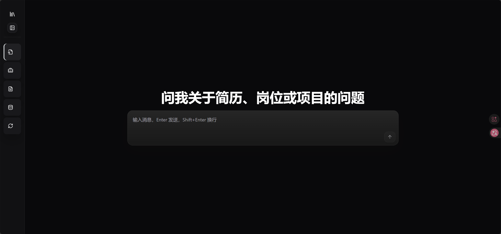
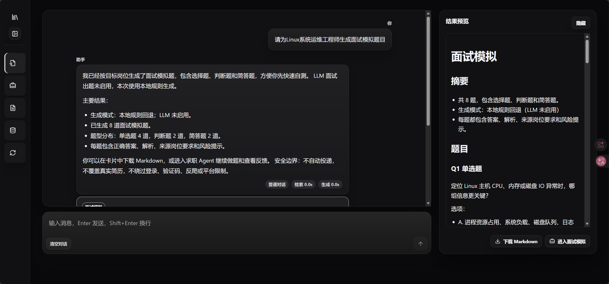
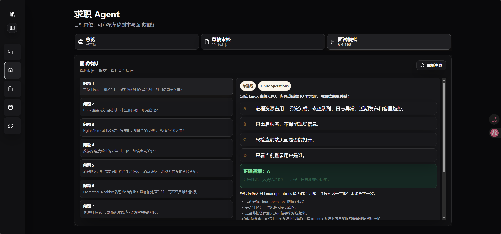
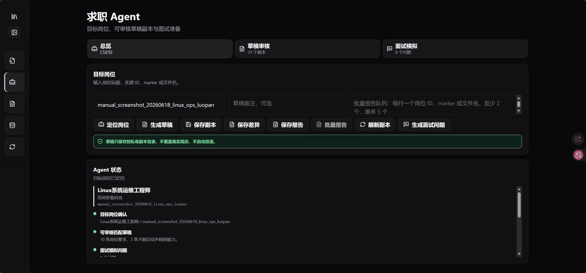
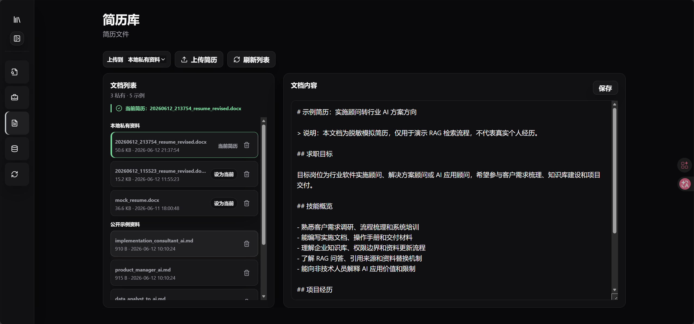
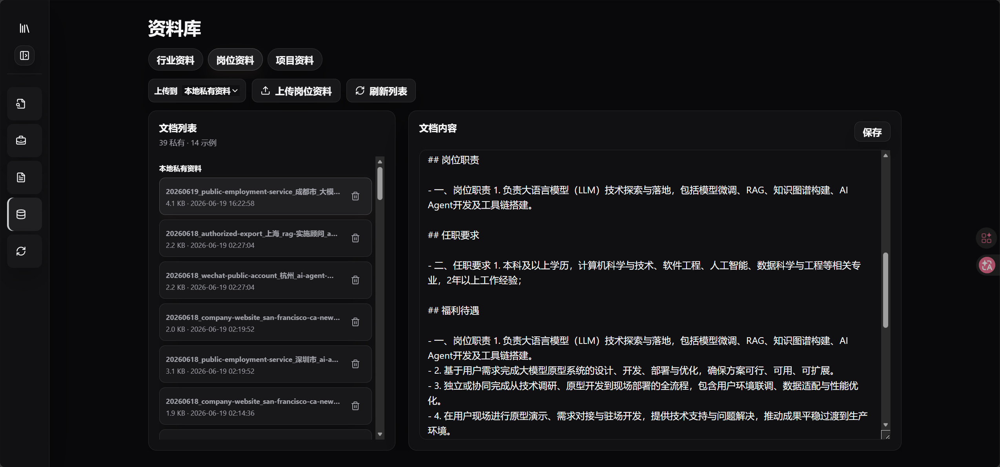
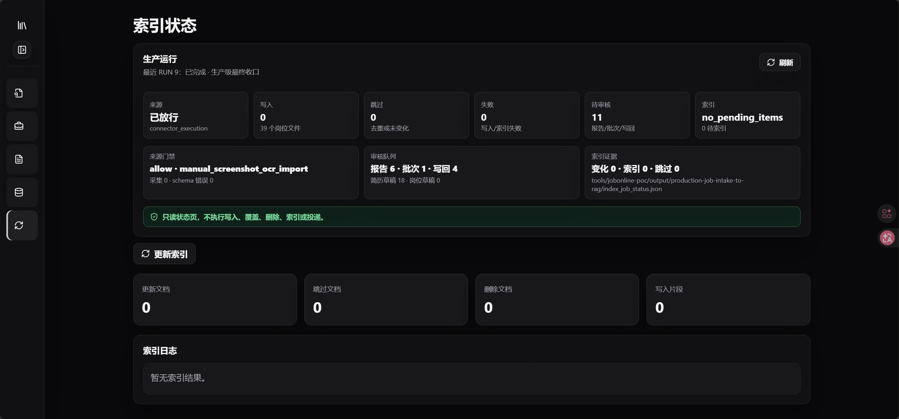

# Local RAG Assistant

Local RAG Assistant 是一个面向个人求职资料管理、岗位资料分析、面试准备和简历优化的本地 Web 应用。它把简历、岗位资料、项目资料和行业资料统一放入本地资料库，通过向量检索、规则工具和大模型问答，帮助用户围绕真实资料完成岗位查找、岗位理解、面试模拟、简历不足分析和可审核的简历优化草稿生成。

这个项目不是招聘平台，也不会自动投递简历。它的核心定位是：把用户已合法导入或手动维护的求职资料变成可查询、可追溯、可用于面试准备和简历改进的本地 RAG 工作台。

## 当前能力

- 资料管理：支持管理简历、岗位 JD、行业资料和项目资料。
- 当前简历：支持设置“当前简历”，涉及“我的简历”的分析会优先使用该简历。
- 本地岗位库：支持查询本地已导入岗位，例如“当前有哪些本地岗位？”。
- 岗位精确查找：支持按岗位 ID、标题、marker 或文件名查找具体岗位。
- 面试模拟：可基于目标岗位生成面试模拟题，包含单选题、判断题、简答题、答案、解析、来源岗位要求和风险提示。
- 简历不足分析：可针对目标岗位分析当前简历证据不足，生成可审核的简历优化草稿。
- 可审核草稿：简历优化草稿不会覆盖真实简历；系统会先备份当前简历，再生成独立候选副本。
- RAG 问答：可基于已索引资料进行资料问答，并展示引用来源。
- 普通对话：非资料类问题会走普通对话，不强行套用 RAG 结果。
- 任务路由：可区分普通问答、资料问答、岗位查询、面试模拟、简历优化、系统说明等常见意图。
- 流式输出：前端实时展示回答生成过程。
- 引用侧栏：资料问答命中引用时，可在右侧查看引用来源；无引用时不显示空引用按钮。
- 本地索引：使用 Qdrant 本地模式保存和检索向量。
- 增量索引：未变化资料可跳过重复索引。

## 不做什么

- 不自动投递简历。
- 不自动覆盖真实简历。
- 不绕过登录、验证码、反爬或招聘平台限制。
- 不代表全网或招聘平台全部岗位。
- 不保证岗位信息实时有效。
- 不把“岗位要求”自动改写成用户真实经历。
- 不把无证据能力直接写入正式简历。

## 界面预览

### 问答分析

用于普通对话、资料问答、岗位查找、面试题生成和简历优化草稿生成。



### 问答分析：资料问答与引用来源

资料问答会展示回答内容、模式、检索耗时、生成耗时，并在有引用时显示引用侧栏。



### 面试模拟题

基于目标岗位生成面试模拟题，右侧可预览题目、答案、解析、来源岗位要求和风险提示。



### 求职 Agent

用于定位目标岗位、生成可审核草稿、保存报告，并进入面试模拟准备流程。



### 简历中心

用于上传简历、删除简历、设置当前简历。当前简历会作为简历分析和岗位匹配的优先资料。



### 资料库

用于管理行业资料、岗位资料和项目资料。Markdown 文档支持在线查看和编辑。



### 索引状态

用于更新本地向量索引，并查看更新、跳过、删除、写入片段等状态。



## 典型使用流程

1. 配置模型 API Key。
2. 启动 FastAPI 后端。
3. 启动 React 前端。
4. 在“简历中心”上传简历，并设置当前简历。
5. 在“资料库”维护岗位、项目和行业资料。
6. 在“索引状态”中更新本地向量索引。
7. 在“问答分析”中提问、查找岗位、生成面试题或生成简历优化草稿。

示例问题：

```text
简单说下什么是 RAG
当前有哪些本地岗位？
根据我的简历，我更适合哪些岗位？
岗位资料里提到的核心能力有哪些？
```

## 面试模拟

面试模拟基于目标岗位资料生成。当前本地规则生成模式会优先使用岗位职责、任职要求和能力域分类，避免把不相关岗位的技术点混入题目。

每道题通常包含：

- 题型
- 题干
- 选项
- 正确答案
- 解释
- 来源岗位要求
- 风险提示

面试题用于面试准备和知识核验，不代表用户已经具备对应能力。

## 简历优化草稿

简历优化不会直接修改真实简历。系统会先读取当前简历，基于目标岗位要求判断哪些内容：

- 可以直接考虑写入
- 需要补证据后再考虑
- 只适合面试准备
- 不能直接声称

生成草稿前会备份当前简历，生成结果是独立可审核副本。用户需要人工审核后再决定是否采用，系统不会自动覆盖真实简历。

## 当前简历机制

简历库中可能存在多份简历，也可能包含公开脱敏样例。为了避免系统把示例简历当成用户本人，系统提供“当前简历”机制：

- 如果只有一份私有简历，系统可将其作为当前简历。
- 如果有多份私有简历，用户需要手动设置当前简历。
- 涉及“我的简历”的问题会优先使用当前简历。
- 如果当前简历尚未进入向量索引，系统会提示先更新索引。
- 公开示例简历只用于演示，不应作为真实用户简历使用。

## 本地岗位库

岗位资料主要来自用户合法导入或手动维护的本地资料。系统支持对本地岗位进行确定性查询，例如：

```text
当前有哪些本地岗位？
现在有哪些岗位？
请查找 AI Agent开发+AI Agent+ 这个岗位
请为岗位 manual_screenshot_20260618_linux_ops_luopan 生成面试模拟题
```

本地岗位清单默认只显示面向用户可见的私有岗位资料，会隐藏阶段自测、样本、远程和公共来源岗位。

## 技术栈

- Python 3
- FastAPI
- React
- TypeScript
- Vite
- Qdrant local mode
- qdrant-client
- python-docx
- pypdf
- requests
- SiliconFlow API
- Chat 模型：`deepseek-ai/DeepSeek-V4-Pro`
- Embedding 模型：`BAAI/bge-m3`

模型价格、限额、可用性和模型名称以平台控制台为准。

## 项目结构

```text
local-rag-assistant/
  backend/
    app.py                         # FastAPI 后端入口
    document_service.py            # 资料管理和当前简历状态
    job_chat_tools.py              # 岗位查询、面试模拟、简历草稿等工具路由
    job_capability_question_engine.py
                                    # 面试题能力域生成器
    job_resolver.py                # 岗位解析与精确查找
    job_matcher.py                 # 岗位与简历证据提取
    rag_service.py                 # RAG / 普通对话 / 工具结果统一回答
    resume_revision_draft_export.py
                                    # 简历优化草稿导出
    resume_backup.py               # 简历备份
    schemas.py                     # API 数据结构
    task_router.py                 # 任务路由和上下文计划

  frontend/
    src/
      App.tsx                      # React 工作台
      api.ts                       # 前端 API 调用
      styles.css                   # 界面样式
      components/ui/               # UI 组件

  src/
    build_index.py                 # 命令行索引入口
    document_loader.py             # md/docx/pdf 文档加载
    indexer.py                     # 增量索引构建
    main.py                        # 模型、Embedding、检索基础能力

  data/                            # 公开示例资料，可提交
  private_data/                    # 本地私有资料，不提交
  private_notes/                   # 本地个人笔记，不提交，也不默认进入 RAG
  qdrant_storage/                  # 本地向量库，不提交
  docs/images/                     # README 截图
```

## 环境变量

不要把真实 API Key 写进代码或提交到 GitHub。

PowerShell 临时配置：

```powershell
$env:SILICONFLOW_API_KEY="your_siliconflow_api_key_here"
```

也可以在项目根目录创建 `.env`：

```env
SILICONFLOW_API_KEY=your_siliconflow_api_key_here
```

前端默认请求本地后端：

```env
VITE_API_BASE_URL=http://127.0.0.1:8000
```

可以参考 `.env.example`，但不要提交真实 `.env` 文件。

## 安装依赖

后端依赖：

```powershell
python -m venv .venv
.\.venv\Scripts\Activate.ps1
pip install -r requirements.txt
```

前端依赖：

```powershell
cd frontend
npm install
```

## 启动应用

先启动后端：

```powershell
uvicorn backend.app:app --reload --host 127.0.0.1 --port 8000
```

再启动前端：

```powershell
cd frontend
npm run dev
```

默认访问地址：

```text
http://127.0.0.1:5173
```

## RAG 流程

```text
上传或维护资料
-> 加载 md/docx/pdf
-> 按标题和内容切分文档片段
-> 调用 Embedding API 生成向量
-> 写入 Qdrant 本地向量库
-> 用户提问
-> 为问题生成向量
-> Qdrant 检索相关片段
-> 拼接上下文并发送给 Chat 模型
-> 流式输出回答
-> 返回最终答案、引用来源和耗时
```

## 隐私与安全边界

- `private_data/` 已加入 `.gitignore`，不应提交到 GitHub。
- `private_notes/` 已加入 `.gitignore`，不应提交到 GitHub，也不默认进入 RAG 索引。
- `qdrant_storage/` 已加入 `.gitignore`，不应提交到 GitHub。
- `.env` 已加入 `.gitignore`，不要提交真实 API Key。
- 构建索引和问答时，真实资料可能会发送给第三方模型 API。
- 如果不希望第三方 API 处理真实隐私内容，请先脱敏，或只使用模拟资料。
- 系统不会自动投递简历。
- 系统不会自动覆盖真实简历。
- 系统不会绕过招聘平台登录、验证码、反爬或访问限制。

## 局限性

- 当前系统依赖用户已合法导入或手动维护的岗位资料，不代表实时招聘市场。
- 当前不是多用户协作平台，缺少完整权限、审计和企业级部署能力。
- 当前使用 Qdrant 本地文件模式，不是生产级高可用向量数据库部署。
- 多轮对话主要依赖前端历史、任务路由和上下文组装，不等同于生产级长期记忆。
- 引用粒度、混合检索、重排序和检索评估仍有改进空间。
- PDF 扫描件暂不支持 OCR。
- 模型回答质量受资料质量、检索结果和模型能力影响。
- 私有资料是否适合发送给第三方 API，需要用户自行评估。

## 后续改进方向

- 替换 README 截图为新版 UI。
- 增加更细的岗位筛选和岗位来源管理。
- 增加检索评估、混合检索和重排序。
- 增加更完整的面试练习流程和答题反馈。
- 增加更稳定的简历草稿对比和人工审核流程。
- 增加批量资料导入和索引健康检查。
- 增强错误恢复、运行诊断和本地部署说明。
